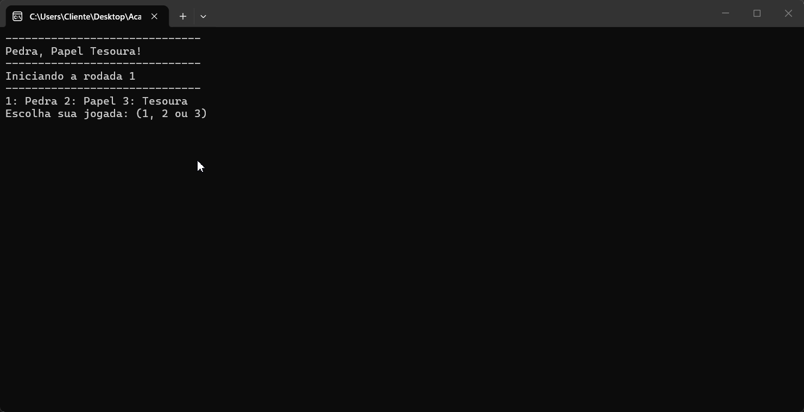

#  PEDRA, PAPEL E TESOURA 



## INTRODUÇÃO

Este projeto consiste em um jogo digital de Pedra, Papel e Tesoura desenvolvido em C# para execução via Console. O sistema permite que um jogador humano dispute contra o computador, utilizando lógica de programação estruturada para determinar o resultado das rodadas.

Desenvolvido por Iago na Academia do Programador.

## FUNCIONALIDADES
* Interface interativa via Console para entrada de jogadas.
* Sistema de escolha do jogador: Pedra, Papel ou Tesoura
* Geração de jogada aleatória para o computador.
* Lógica de decisão baseada nas regras do jogo: Pedra vence Tesoura/ Tesoura vence Papel/ Papel vence Pedra.
* Identificação automática de: Vitória do jogador, Vitória do computador, Empate.
  Exibição do resultado com cores:

  🟢 Verde → vitória do jogador

  🔴 Vermelho → vitória do computador

  ⚫ Cinza → empate

* Sistema de repetição de partidas sem reiniciar o programa.
* Conversão de valores numéricos para texto (uso de switch).

## Como utilizar o programa

1. Clone o repositório ou baixe o código comprimido em .zip.
2. Abra o emulador de terminal e navegue até a pasta raiz.
3. Utilize o comando abaixo para restaurar as dependências do projeto.

     ```
     dotnet restore
     ```

4. Em seguida compile e execute o projeto com o comando: 

    ```
    dotnet run --project PedraPapelTesoura.Console.App
    ```

## Requistitos

* .NET SDK 10.0